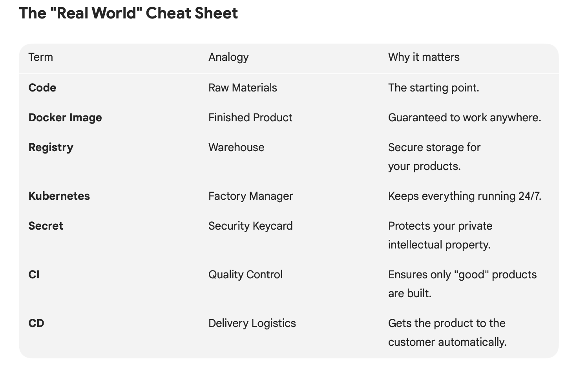

## Day 1 & 2

#### 1. The Core Building Block: Docker (The "Package")
Before automation, we have ""Packaging"". Docker is the tool that ensures your application is portable and can be access on any other endpoints. 

#### 2. The Manager: Kubernetes (The "Orchestration")
If Docker is a brick, then the Kubernetes will act as the construction crew that manages thousands of bricks.

- Self-healing: It will automatically restart pod when it's crash
- High-availability: By running multiple pods in multiple replicas, your services stays up to date even though theres an interruption of nodes

#### 3. The infra bridge: Registry & Secret
- The Container Registry: A secure digital warehouse, it stores your versioned images 
- Kubernetes Secret(imagePullSecret): The "KEYCARD" Because professional registries are stays private, usually the cluster stores the credential as secret. The cluster uses this KEYCARD to authenticate with the registry and pull the images   

#### 4. The Methodology: CI/CD
This is the "Engine" that connects everything together

#### CI(Continuous Integration)
- Goal: Code Quality & Artifact Creation
- Process: Triggered by git push or the action that may change the repos. It runs test, validate the code, and builds the Docker image
- Outcome: A verified image is pushed to the Registr. It is "READY TO SALE"

#### CD(Continuous Deployment)
- Goal: Speed to Production & Uptime
- Process: Pulls the new image from the Registry and updates the Kubernetes Deployment
- Outcome: The live application is updated with zero downtime using a "Rolling Update."

#
### Summary

